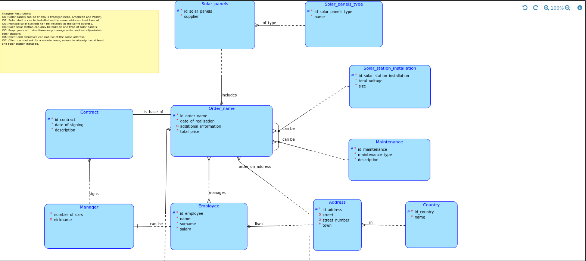
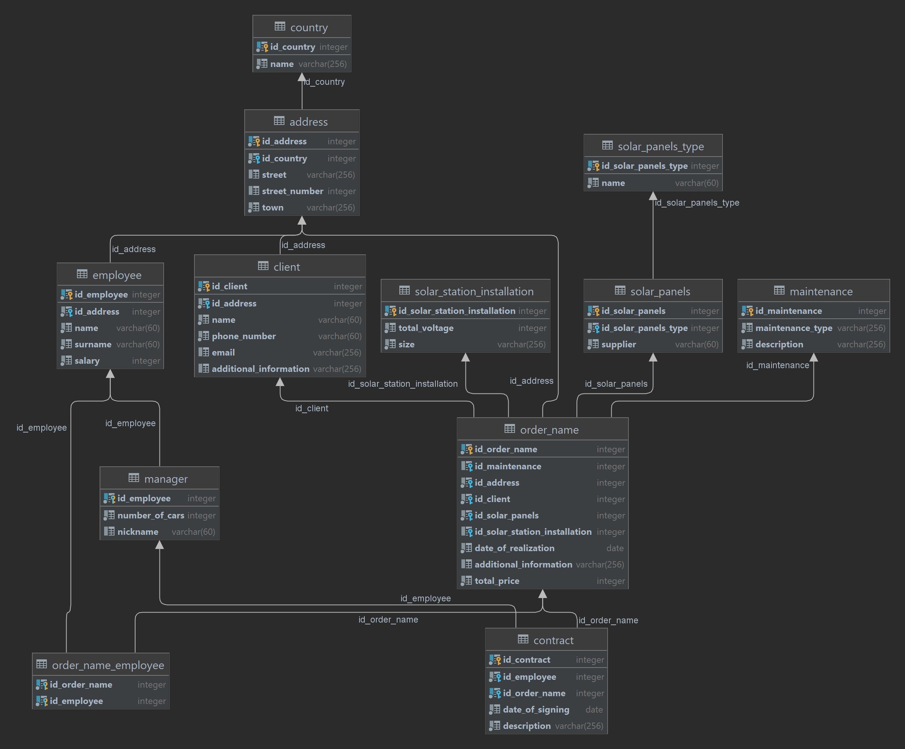

# **PostgreSQL Solar Panel Database** ☀

## **Project Description** 

This project involves the design and implementation of a PostgreSQL database tailored for managing the data associated with a solar panel system. The database is structured to store information about various entities involved in the system, such as panels, installations, and energy production. This database is useful for tracking the performance and management of solar panel installations.

## **Project Structure** 

- **`assets/`**: Contains images related to the database schemas.
    - **`conceptual_schema.png`**: Visual representation of the conceptual schema of the database.
    - **`relation_schema.png`**: Visual representation of the relational schema of the database.
- **`create_script.sql`**: SQL script for creating the database schema.
- **`insert_script.sql`**: SQL script for inserting initial data into the database.
- **`queries.sql`**: SQL script containing various queries to interact with and extract information from the database.

## **Technology Stack** 

- **Database**: PostgreSQL
- **Languages**: SQL
- **Tools**: pgAdmin, DBeaver
- **Concepts**: Relational Database Design, Data Integrity, SQL Querying

## **Database Schema** 

### **Conceptual Schema** 
The conceptual schema outlines the high-level entities and relationships within the solar panel system.



### **Relational Schema** 
The relational schema provides a detailed view of the tables, columns, and relationships implemented in the PostgreSQL database.



## Loops Discussion: 

### **Loops in the Conceptual Schema** 

In the conceptual schema, several loops define the relationships and constraints between employees, clients, orders, and addresses. Here's a summary of these loops and their associated rules:

1. **Employee → Order → Solar Station Installation/Maintenance**:
    - **Rule**: The same employee cannot both manage an order and work on the installation or maintenance of solar stations. This separation ensures distinct management and operational roles.

2. **Client → Address and Employee → Address**:
    - **Rule**: Employees and clients cannot reside at the same address. This prevents conflicts of interest and maintains a professional boundary.

3. **Employee → Manager → Contract → Order and Employee → Order**:
    - **Rule**: An employee cannot manage an order and sign a contract for the same order. This enforces a division of responsibilities to avoid any misuse of authority.

4. **Client → Order → Address and Client → Address**:
    - **Rule**: Solar stations can be installed at the same address where the client lives. This reflects the practical need for installations at the client's residence.

5. **Employee → Order → Address and Employee → Address**:
    - **Rule**: Employees cannot live at the address where a solar station is being installed. This maintains impartiality and prevents personal interest conflicts.

These loops and constraints help ensure the integrity and efficiency of the solar panel service process by clearly defining roles and avoiding potential conflicts.


## **SQL Scripts Overview** 

### **1. `create_script.sql`**
This script contains the SQL commands necessary to create the database schema. It defines the tables, columns, data types, and relationships between the tables.

### **2. `insert_script.sql`**
This script includes SQL commands to populate the database with initial data. It inserts sample records into the tables to help visualize and query the data.

### **3. `queries.sql`**
This script provides various SQL queries to interact with the database. These queries allow for data retrieval, analysis, and management tasks based on the stored information.

## **How to Use the Project** 

### **Step 1: Set Up the Database**

1. **Create the Database**:
    - Use the `create_script.sql` to create the necessary tables and relationships in your PostgreSQL instance.
      ```bash
      psql -U your_username -d your_database -f create_script.sql
      ```

2. **Insert Initial Data**:
    - Use the `insert_script.sql` to populate the database with sample data.
      ```bash
      psql -U your_username -d your_database -f insert_script.sql
      ```

### **Step 2: Run Queries**

- You can run the queries provided in `queries.sql` to interact with the data and perform various analyses.
  ```bash
  psql -U your_username -d your_database -f queries.sql

## Conclusion
This project provides a comprehensive database solution for managing and analyzing solar panel system data.